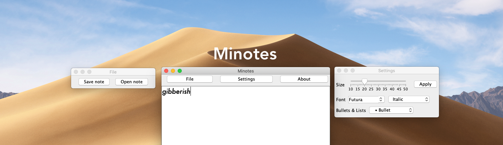

# Minotes
An minimal notepad.

# Features :
- Very easy to understand and use interface
- Ability to save,read and write txt,rtf,html,iml and xml files
- Ability to apply fonts to text
- Format text as Plain, Bold, Italic or Bold & Italic
- Usual keyboard combinations (example : undo, copy, paste) work without issues

# Known issues : 
- Only reads the last line of document(fixed as of 13.05.2020)
- Unresponsive settings interface(fixed as of 15.05.2020)
- Unscrollable main window(fixed as of 13.05.2020)

# Updates :
- 11.05.2020 : Changed name from "Minimal Notepad" to "Minotes".
- 12.05.2020 : Added Bullet caps,Line,Stars,etc.
- 13.05.2020 : Bug fixes.
- 15.05.2020 : Reworked Settings UI / Bug fixes. (as of b0.8)
- 16.05.2020 : Introducing b0.8.5!The version that will be pushed to public,compiled for Windows,macOS and Linux!Fonts will be found automatically by the program. ; Renamed "Bullets & Lists" to "Punctuating lists". ; Readded "Format" Label in front of the formatting.
