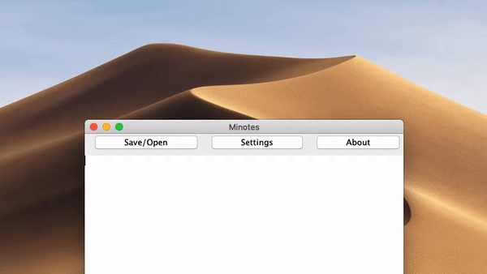

# Minotes
An minimal notepad.

# Features :
- Very easy to understand and use interface
- Ability to save,read and write rtf, txt, doc and docx files
- Ability to apply fonts to text
- Format text as Plain, Bold, Italic or Bold & Italic
- Usual keyboard combinations (example : undo, copy, paste) work without issues

# Known issues : 
- Only reads the last line of document(fixed as of 13.05.2020)
- Unresponsive settings interface
- Unscrollable main window(fixed as of 13.05.2020)

# Updates :
- 11.05.2020 : Changed name from "Minimal Notepad" to "Minotes".
- 12.05.2020 : Added Bullet caps,Line,Stars,etc.
- 13.05.2020 : Bug fixes
