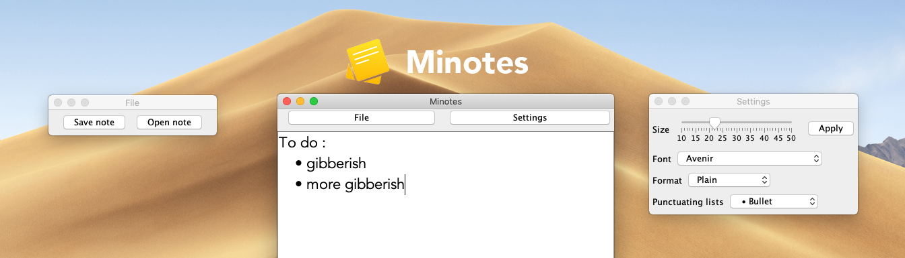

# Minotes
An minimal notepad.

# Features :
- Very easy to understand and use interface
- Ability to save,read and write txt,rtf,html,iml and xml files
- Ability to apply fonts to text
- Format text as Plain, Bold, Italic or Bold & Italic
- Usual keyboard combinations (example : undo, copy, paste) work without issues

# Known issues : 
- Only reads the last line of document(fixed as of 13.05.2020)
- Unresponsive settings interface(fixed as of 15.05.2020)
- Unscrollable main window(fixed as of 13.05.2020)

